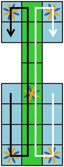
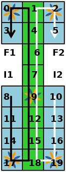

# Juego royal de Ur

## Reglas

Las reglas son simples: 

1. El juego es por turnos
2. Hay 4 Dados de 2 lados que acumulan sus puntos (asi tienes de 0 hasta 4 puntos cada ronda)
3. Cada jugador tiene 7 piezas, que tiene que mover desde el inicio hasta el fin (ve al grafico siguiente para verlo mejor)
4. Al inicio de su ronda el jugador juga a sus dados. Ahora puede eligir si mueve una pieza en la tabla o si entra una nueva pieza a la tabla
5. Si su pieza termina en una castilla ocupada por pieza del otro jugador la pieza del otro jugador vuelve al inicio
6. Si su pieza termina en una casilla de estrella el jugador gana otro turno
7. Piezas en una casilla de estrella estan protegidos, asi en cambio a regla 5 si una pieza termina en una castilla de estrella ocupada se mueve una castilla más adelante (donde regla 5 si se cumple)
8. Piezas no pueden mover a castillas ocupadas con piezas del mismo jugador
9. Si el jugador no puede mover ninguna pieza pierde este turno


## Mapa del juego


---
# Empezamos con el tutorial

Creamos tres archivos: 
- ur.html : contiene la pagina del juego
- ur.js : contiene el codigo del juego
- ur.css : contiene el css (declaraciones de apariencia) del juego

---
# Ur.html

El esceleton de una pagina html esta separado entre una cabeza `<head>` y el cuerpo `<body>`. En el `<head>` declaramos cosas "meta", cosas que no aparecen directamente en la pagina. En el `<body>` declaramos los elementos que aparecen en la pagina. 

```
<html>
    <head>
    </head>
    <body>
    </body>
</html>
```

Al `<head>` vamos a copiar el tag `<title>` para pasar un titulo al navegador:
```
<title>Juego de Ur</title>
```

Despues quieremos incluir nuestro css del archivo ur.css (aunque todavia esta blanco). para eso incluimos el tag siguiente:
```
<link rel="stylesheet" href="ur.css">
```

Al fin quieremos incluir nuestro codigo de javascript cun un tag de `<script>`:
```
<script src="ur.js"></script>
```

Nuestro head debe parecer algo asi:

```
<head>
<title>Juego de Ur</title>
<link rel="stylesheet" href="ur.css">
<script src="ur.js"></script>
</head>
```
Guardalo y abrelo en el firefox. Es una Pagina blanca, porque no hemos definido nada todavia por el cuerpo.

---
# el cuerpo `<body>`

En el cuerpo vamos a definir un esceleton crudo para nuestro juego: 
```
<div id="jugador1">
</div>
<div id="jugador2">
</div>
<div id="mesa">
</div>
```
Eso significa que tenemos un espacio para jugador 1, un espacio para jugador 2 y un espacio para la mesa. 
Vamos a llenar esos espacios con algo sencillo ya, lo pongamos titulos con los nombres del jugador:
```
<div id="jugador1">
<h2 id="nombre1">Jugador 1</h2>
</div>
<div id="jugador2">
<h2 id="nombre2">Jugador 2</h2>
</div>
```
Ves que les damos siempre un ID? Una id es como un nombre del elemento y debe ser unico en la pagina. Con ese ID podemos llegar muy facil al elemento con Javascript. 
Tambien lo podemos usar en nuestro CSS. 

Y justo eso vamos a hacer ahora. Guarda el ur.html y abre en Atom el archivo ur.js. Como en Atom puedes tener dos paneles con codigo, abre el ur.html en el panel de izquierda y el ur.js en el panel de derecha - asi puedes ver ambos archivos al mismo momento - que va a ser muy util como veas pronto. 

el ur.html en total debe aparecer ahora como asi:

```
<html>
    <head>
        <title>Juego de Ur</title>
        <link rel="stylesheet" href="ur.css">
        <script src="ur.js"></script>
    </head>
    <body>
        <div id="jugador1">
            <h2 id="nombre1">Jugador 1</h2>
        </div>
        <div id="jugador2">
            <h2 id="nombre2">Jugador 2</h2>
        </div>
        <div id="mesa">
        </div>
    </body>
</html>
```
---
# ur.js

Aqui estamos lo más comodo, nuestro codigo :)
Te recuerdas todo de Objetos, Variables, Listas y funciones?
Una sobrevista cortita para que lo recuperas. Todavia estamos muy simplificando:

## Variables

Variables son nombres bajo que puedes guardad cualquier informacion. La informacion puede ser simple como un numero, complejo como un texto o abstracto como un objeto o una funcion. Variables estan siempre en un contexto. Asi si declares Variables en el codigo no más eso llamamos "global" - es decir de cualquier parte del programa lo puedes llamar a este variable. Eso evitamos en general maximo posible, para que no nos confundimos con las variables y para que eran. Pero si claro, lo usamos. 

Una variable se declara como 
```
var nombreDeMiVariable = valor;
```

Variables pueden tener diferentes tipos de valor. Vamos a ver cuales:

```
var miTexto = "mi texto de ejemplo";
var miNumero = 123;
var miLista = [1,2,3,4];
var miObjeto = {texto:"texto de ejemplo",numero:123,lista:[1,2,3]};
```

miTexto es una variable de tipo *string* - que significa un texto. 
miNumero es una variable del tipo *number* - un numero. 

un ejemplo de diferencia y que pasa si lo mesclas: 
```
miTexto = miTexto + 1;
miNumero = miNumero + 1;
```
miTexto ahora es "mi texto de ejemplo1" y miNumero es 124. 
Eso es muy importante a ver, porque lo usaremos un monton. Si te pasa que un numero cambia a ser un texto muchas veces es por eso. Ahi nos hace facil y dificil al mismo momento que no tenemos que preocuparnos del tipo de la variable y que se puede cambiar automaticamente. Si hacemos por ejemplo:
```
miNumero = miNumero + "1";
```
miNumero cambiara a ser un texto y entonces no calcula pero conjunta la 1 al otro. a vez de que miNumero sea 124 sea "1231". 

## Listas y Objetos

Tenemos que ordenar nuestras variables, si no sea muy dificil entender y trabajar con codigo. Para eso usamos dos formas: listas y objetos. 
Una lista, se llama *Array* es un container para variables. Es decir a vez de un valor contienen muchos. esos valores tambien pueden ser de todos tipos de variables. 
En nuestro ejemplo tenemos una lista con 4 entradas de numeros. Hacemos dos listas:
```
miListaDeNumeros = [1,2,3,4];
miListaDeTextos = ["a","b","c","d"];
```

Como podemos tener accesso a los valores? Con el estilo `nombre[indice]`:
miListaDeNumeros[0] es 1, miListaDeNumeros[1] es 2...
miListaDeTextos[0] es "a", miListaDeTextos[1] es "b"...

**IMPORTANTE**: Listas empienzan en 0, no en 1. La primera entrada de una lista es 0! Porque al inicio era un 0, no un 1 ;)

Objetos son más abstracto todavia. Son como un container que puede tener todo, pero por nombre a vez de numero. Asi el objeto de ejempo era:
```
var miObjeto = {texto:"texto de ejemplo",numero:123,lista:[1,2,3]};
```

Como puedes ver lo declaramos con {} para ser un objeto. Aldentro del {} en ese forma de declaración se cambia de usar un "=" a un ":" para declarar. 
Asi construimos un objeto que *contiene* las variables texto, numero y lista. 
Si quiero obtener su valor puedo llamarlo con su nombre con un punto y despues el nombre de la variable:

1. miObjeto.texto
2. miObjeto.numero
3. miObjeto.lista

## Funciones

Una funcion contiene *codigo*. Cuando llamas a una funcion lo cumple el codigo que contiene. Lo usamos muchisimo para que no tenemos escribir lo mismo otra vez y otra vez y otra vez y otra vez y otra vez y otra vez...
Pero tambien para ordenar nuestro codigo, danos una sobrevista mejor de lo que esta pasando. Una funcion puede ser llamado con parametros y puede pero no necesita revolver un valor al llamador. 

Se puede declarar una funcion de dos maneras:
```
function miFuncion(parametro){

}
var miFunction2 = function(parametro){
 
}
```
La primera constituye una function global con nombre miFuncion, la segunda hace lo mismo pero con nombre miFuncion2. Porque hay dos formas? Pues la segunda forma usaremos mucho, cuando quieremos declarar funciones de objetos:
```
miObjeto.miFuncion = function(){

}
```

Para llamar funciones les llamas con su nombre y () al fin. aldentro de los () puedes pasar los parametros que la funcion espera: 
```
miFuncion("asdf");
miFuncion2("asdf");
miObjeto.muFuncion();
```

Una funcion puede volver un valor con `return`, el recipiente puede hacer con ese valor lo que quiere - por ejemplo guardarlo en una variable:

```
functino cualEsMiNombre(nombre){
    return "tu nombre es "+nombre;
}

var retorno = cualEsMiNombre("famosa");
```
retorno ahora tiene el valor "tu nombre es famosa".

Todo bien?
---
# Empezamos

Si entendiste todo anterior empieza con declarar tus variables para darle estructura. Abre el ur.js - que debe ser blanco todavia (si entraste las cosas anteriores borrales).
Empezamos a declarar nuestro juego como un objeto:
```
var juegoUr = {};
```
Despues vamos a añadirla una funcion que se llama init:
juegoUr.init = function(){

}
```

aldentro de esa funcion init vamos a escribir: 
```
var nombre1 = prompt("por favor dame tu nombre usuario 1");
var nombre2 = prompt("por favor dame tu nombre usuario 2");
```

el prompt pregunta al usuario por una entrada de texto y lo guardes en las variables. 
despues quieremos guardar los nombres, pero como cada usuario puede tener más cosas despues (puntos, turnos...) lo abstraimos otra vez con un nuevo objeto aldentro del juego: 
```
juegoUr.jugador1 = {nombre:nombre1};
juegoUr.jugador2 = {nombre:nombre2};
```
ahora tenemos un objeto juegoUr con dos jugadores, que tienen su nombre. lo añadimos al documento: 
```
var tituloJugador1 = document.getElementById("nombre1");
var tituloJugador2 = document.getElementById("nombre2");
tituloJugador1.innerText = nombre1;
tituloJugador2.innerText = nombre2;
```
Que pasó ahi? bueno, lo preguntamos al documento al elemento con la id "nombre1" y al elemento con la id "nombre2" y cambiamos su valor de innerText al nombre que hemos recibido de los usuarios. 
buenisimo. 
tu funcion de init debe aparecer ahora asi: 
```
juegoUr.init = function(){
    var nombre1 = prompt("por favor dame tu nombre usuario 1");
    var nombre2 = prompt("por favor dame tu nombre usuario 2");
    juegoUr.jugador1 = {nombre:nombre1};
    juegoUr.jugador2 = {nombre:nombre2};
    var tituloJugador1 = document.getElementById("nombre1");
    var tituloJugador2 = document.getElementById("nombre2");
    tituloJugador1.innerText = nombre1;
    tituloJugador2.innerText = nombre2;
}
```
falta de llamarlo. lo hacemos en el archivo de html. cambiamos el tag `<body>` en que entramos a este tag un "onload" a donde pasamos que debe hacer:
```
<body onload="juegoUr.init()">
```

Todo guardado? 
Abre de nuevo el html en el firefox para ver si funciona. 
---
# apareción de la pagina

La pagina funciona y el script ya esta cambiando algo - pero no parece lindo por nada. 
Lo vamos a mejorar un poco con css. 
Abre el archivo ur.css y ponga:
```
body {
    display:grid;
    grid-template-areas:"jugador1 mesa jugador2";
    grid-template-columns: 20% 60% 20%; 
}
#jugador1{
    grid-area:jugador1;
}
#jugador2{
    grid-area:jugador2;
}
#mesa{
    grid-area:mesa;
}
```
Eso es codigo CSS. 

CSS no es programar, aunque se puede hacer muchas cosas con eso. CSS es una forma de declaraciones. Solo puedes declarar valores. Pero estas valores son interpretada del Navegador para saber como debe aparecer la pagina. 
Lo puedes cambiar estos valores del Elemento en CSS y en javascript directo. Usamos CSS para eso porque es bien estilo tenerlo separado - te facilita mucho cuando quieres cambiar cosas despues. 

CSS funciona en que eliges cual elemento debe tener cuales valores. 
Principalmente hay tres cosas para distinguir elementos: 
- El tag
- una id
- una clase

El tag del elemento escribes asi no mas: por ejemplo el "body" es el elemento body. 
Si hagas una regla para "div" sea para todos divs de la pagina. 

La id es lo más especifico, como solo debe aparecer una vez en la pagina. Una id escribes con un numeral *#* al inicio: *#jugador1*  o *#mesa* por ejemplo. 

Clases no usamos todavia. Se escribe con un punto al inicio: *.miClase*

Despues se entra como en el estilo "objeto" de javascript los valores de esta declaración css. 

---
# en detalle

```
body {
    display:grid;
    grid-template-areas:"jugador1 mesa jugador2";
    grid-template-columns: 20% 60% 20%; 
}
#jugador1{
    grid-area:jugador1;
}
#jugador2{
    grid-area:jugador2;
}
#mesa{
    grid-area:mesa;
}
```

Veamos otra vez al ejemplo:

Con eso hemos posicionado los diferentes elementos en la pagina con una tecnica que se llama grid. Guarda el archivo y abre ur.html de nuevo en firefox. Ahora los nombres de jugadores estan a los lados de la pagina con espacio en el medio. 

Con *display:grid* decidimos que el body debe posicionar los elementos niños *children* en un grid. *grid-template-areas* define tres zonas del grid, con nombres para que lo podemos reusar despues. como estan en una linea (entre "") estan al lado del otro. 
Con *grid-template-columns* definimos el tamaño horizontal *width* de cada zona - sean 20% por los jugadores y 60% para la mesa del espacio que hay. 

despues definimos para los diferentes elementos con *grid-area* en que zona deben aparecer. jugador1 en jugador1, jugador2 en jugador2 y mesa en la zona mesa. Se llaman igual y eso es bueno, pero no necesario. pero es buen estilo para no pensar "como llamé la zona...?".


Bien - concluiste el primer nivel.
---
# Que hemos aprendido?

- como escribir el esceleton del html
- como escribir css en general
- como posicionar elementos con grid
- como escribir una estructura en javascript y empezar con el codigo
- como cambiar valores de elementos en la pagina

A continuar pronto...

---
# La tabla

Vamos a empezar con la tabla. Lo vamos al ur.html y entramos aldentro del **div** con **id="mesa"** un nuevo div para la tabla y otro div para los dados:
```
<div id="dados">
</div>
<div id="tabla">
</div>
```

Ahora vamos a llenar la tabla con los castillas. para los castillas vamos a usar botones: 
```
<button class="castilla"></button>
```
De esos elementos *button* nececitamos en total 20. copia ese linea entonces 20 veces a la tabla. Esos botones llegan en un orden numeral aldentro de la tabla. El orden va a ser asi:
```
0  1  2
3  4  5
   6 
   7
8  9  10
11 12 13
14 15 16
17 18 19
```

Ese orden es muy importante para recordarnos. Para hacernos más facil lo pongamos entonces los numeros aldentro de los botones - desde 0 hasta 19. Asi lo veamos siempre cuando chequeamos el codigo. La seccion de la mesa debe estar ahora en total asi:
```
<div id="mesa">
    <div id="dados">
    </div>
    <div id="tabla">
        <button class="castilla">0</button>
        <button class="castilla">1</button>
        <button class="castilla">2</button>
        <button class="castilla">3</button>
        <button class="castilla">4</button>
        <button class="castilla">5</button>
        <button class="castilla">6</button>
        <button class="castilla">7</button>
        <button class="castilla">8</button>
        <button class="castilla">9</button>
        <button class="castilla">10</button>
        <button class="castilla">11</button>
        <button class="castilla">12</button>
        <button class="castilla">13</button>
        <button class="castilla">14</button>
        <button class="castilla">15</button>
        <button class="castilla">16</button>
        <button class="castilla">17</button>
        <button class="castilla">18</button>
        <button class="castilla">19</button>
    </div>
</div>
```

Guardalo y vea como aparece en el firefox
Bien. Tiene 20 botones gris ahora, estan ya dentro de los jugadores, pero como una tabla no parece todavia, cierto? 

vamos abrir el ur.css y pongamos una declaración de *grid* a la tabla:
```
#tabla{
    display:grid;
    grid-template-columns: 33% 33% 33%;
}
```

guardamos - abrimos el firefox: 
bien. ahora es una tabla de tres columnos. Pero no es como la tabla del juego. 
Veamos otra vez a la tabla como debe ser:
```
0  1  2
3  4  5
   6 
   7
8  9  10
11 12 13
14 15 16
17 18 19
```

La 6 y la 7 estan solitos entre espacio libre. Si entramos algo ahi lo tenemos una tabla llena. Como abajo es el inicio y arriba es el fin - vamos a usar ese espacio justo por eso. Nececitamos entonces una tabla asi: (F1 es fin Jugador1, I1 es inicio de Jugador1, 
F2 es fin Jugador2, I2 sea inicio Jugador2)

```
0  1  2
3  4  5 
F1 6  F2
I1 7  I2
8  9  10
11 12 13
14 15 16
17 18 19
```

Entramos elementos basicos (no nececitan un click) en **ur.html** a sus posiciones y les damos un id correspondiente a su uso para que les podemos ver mejor mas tarde:
```
                ...
                <button class="castilla">5</button>
                <div id="finJugador1"></div>
                <button class="castilla">6</button>                
                <div id="finJugador2"></div>
                 <div id="inicioJugador1"></div>
                <button class="castilla">7</button>
                <div id="inicioJugador2"></div>
                ...
```

La tabla entera debe aparecer asi:

```
<div id="tabla">
    <button class="castilla">0</button>
    <button class="castilla">1</button>
    <button class="castilla">2</button>
    <button class="castilla">3</button>
    <button class="castilla">4</button>
    <button class="castilla">5</button>
    <div id="finJugador1"></div>
    <button class="castilla">6</button>                
    <div id="finJugador2"></div>
     <div id="inicioJugador1"></div>
    <button class="castilla">7</button>
    <div id="inicioJugador2"></div>
    <button class="castilla">8</button> 
    <button class="castilla">9</button>
    <button class="castilla">10</button>
    <button class="castilla">11</button>
    <button class="castilla">12</button>
    <button class="castilla">13</button>
    <button class="castilla">14</button>
    <button class="castilla">15</button>
    <button class="castilla">16</button>
    <button class="castilla">17</button>
    <button class="castilla">18</button>
    <button class="castilla">19</button>
</div>
```

Guardamos, abrimos en firefox: Bien! Ahora tenemos los botones como deben aparecer en el juego. Son gris y tal, pero ahi estan, ya funcionables :)
Pero lo que falta es distinguir ciertas castillas - las castillas con la estrella. 
Veamos a la mapa y lo comparemos con la de rules:
```
0  1  2
3  4  5 
F1 6  F2
I1 7  I2
8  9  10
11 12 13
14 15 16
17 18 19
```
combinado:


Los numeros 0, 2, 9, 17 y 19 tienen estrellas. 
Asi vamos a añadir una clase más a esos elementos, la classe estrella. por ejemplo al boton 19: 

```
    <button class="castilla estrella">19</button>
```

Asi igual a los otros botones. 
Tu tabla debe estar ahora asi:
```
<div id="tabla">
                <button class="castilla estrella">0</button>
                <button class="castilla">1</button>
                <button class="castilla estrella">2</button>
                <button class="castilla">3</button>
                <button class="castilla">4</button>
                <button class="castilla">5</button>
                <div id="finJugador1"></div>
                <button class="castilla">6</button>                
                <div id="finJugador2"></div>
                 <div id="inicioJugador1"></div>
                <button class="castilla">7</button>
                <div id="inicioJugador2"></div>
                <button class="castilla">8</button> 
                <button class="castilla estrella">9</button>
                <button class="castilla">10</button>
                <button class="castilla">11</button>
                <button class="castilla">12</button>
                <button class="castilla">13</button>
                <button class="castilla">14</button>
                <button class="castilla">15</button>
                <button class="castilla">16</button>
                <button class="castilla estrella">17</button>
                <button class="castilla">18</button>
                <button class="castilla estrella">19</button>
            </div>
```
Guarda todo, abre el firefox y vealo. 
No ves ninguna diferencia? Vale. Hay que usar CSS:
abrir ur.css y ponga la declaración siguiente:
```
.estrella{
    background:red;
}
```
Lo que digamos en esa declaracion es que todos elementos que tienen la clase *estrella* deben tener un fondo **background** en rojo. 
No es lo mas lindo, pero para verlo por ahora alcanza. 
Guardamos todo, reload en el firefox... 
Al fin. La tabla con estrellas. 

Ahora, como estamos ya en el css, vamos a declarar unas cosas más:
quieremos que la tabla esta mas linda. para eso podemos declarar el tamaño de las castillas:

```
.castilla{
    width:10vh;
    height:10vh;
}

```
Bien. Ya son cuadrados. Pero estan muy lejos de cada uno. 
A la tabla pongamos un **grid-gap** de **1vh** y un **width** de **33vh**:
```
#tabla{
    display:grid;
    grid-template-columns: 33% 33% 33%;
    grid-gap:1vh;
    width: 35vh;
}
```
Ahora la tabla esta bien, per pegado a la izquierda. 
cambiamos la mesa:
```
#mesa{
    grid-area:mesa;
    display: grid;
    grid-template-areas: "dados1 tabla dados2";
    grid-template-columns: 1fr auto 1fr;
}
```
Otra vez declaramos un nuevo grid con **display:grid**. definimos tres areas: **grid-template-areas: "dados1 tabla dados2"** y tambien el tamano de las columnas: **grid-template-columns: 1fr auto 1fr**. 
Lo que usamos aqui es **1fr** es una fraccion: es decir se divide el "espacio sobre" en fracciones. **auto** es decir que el tamaño depende del contenido del elemento. 

Solo falta cambiar la tabla para darle la información que debe estar en la area tabla:
```
#tabla{
    display:grid;
    grid-template-columns: 33% 33% 33%;
    grid-gap:1vh;
    grid-area: tabla;
    width: 35vh;
}
```

Tu ur.css debe aparecer ahora asi:
```
body {
    display:grid;
    grid-template-areas:"jugador1 mesa jugador2";
    grid-template-columns: 20% 60% 20%; 
}
#jugador1{
    grid-area:jugador1;
}
#jugador2{
    grid-area:jugador2;
}
#mesa{
    grid-area:mesa;
    display: grid;
    grid-template-areas: "dados1 tabla dados2";
    grid-template-columns: 1fr auto 1fr;
}
#tabla{
    display:grid;
    grid-template-columns: 33% 33% 33%;
    grid-gap: 2vh;
    grid-area: tabla;
    width: 35vh;
}

.estrella{
    background:red;
}
.castilla{
    width:10vh;
    height:10vh;
}

```

Felicitaciones. Lograste terminar este parte largo del tutorial. 


