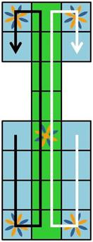

# Vamos a continuar.

el ur.js debe aparecer ahora asi:
```
juegoUr = {};

juegoUr.init = function(){
    var nombre1 = prompt("por favor dame tu nombre usuario 1");
    var nombre2 = prompt("por favor dame tu nombre usuario 2");
    juegoUr.jugador1 = {nombre:nombre1};
    juegoUr.jugador2 = {nombre:nombre2};
    var tituloJugador1 = document.getElementById("nombre1");
    var tituloJugador2 = document.getElementById("nombre2");
    tituloJugador1.innerText = nombre1;
    tituloJugador2.innerText = nombre2;
}

juegoUr.jugarDados = function(){
    var dados = [];
    var resultado = 0;
    for(var x=0;x<4;x++){
        dados[x] = Math.floor(Math.random()*2);
        resultado+=dados[x];
        var img = document.getElementById("dado"+x);
        var nombreArchivo="dado";
        if(dados[x]===1){
            nombreArchivo = nombreArchivo+"a";
        }else{
         nombreArchivo = nombreArchivo+"b";
        }
        nombreArchivo = nombreArchivo+Math.floor(Math.random()*3);
        nombreArchivo = nombreArchivo+".png";
        img.src=nombreArchivo;
    }
    this.dadosJuntos = resultado;
    var enHtml = document.getElementById("dadosJuntos");
    enHtml.innerText = resultado;
}

juegoUr.turno = function(){
    this.jugarDados(); //ahora se actualizó los dados y los puntos para el turno actual
    if(this.dadosJuntos===0){
        alert("oh, un 0... perdiste tu turno");
        this.terminaTurno(); //no hay más que hacer en un 0
        return;
    }
}

juegoUr.terminaTurno = function(){
    if(this.jugadorActual===1){
        this.jugadorActual = 2;
    }else{
        this.jugadorActual=1;
    }
    this.turno();
    var dados = document.getElementById("dados");
    dados.classList.toggle("jugador2");
}
```

---

## ahora vamos serio

empezamos a escribir ahora mucho. vamos paso a paso, pero sube el nivel.

lo que nesecitamos para continuar sea una construcción en javascript del juego.
vamos a ver que tiene:
1. tiene castillas a donde piezas pueden irse
2. tiene piezas de los jugadores que pueden moverse a castillas
3. tiene inicio y gol de cada jugador
4. cada jugador tiene su camino propio como irse desde inicio hasta el gol

asi empezamos. como los dados se juegan automaticamente cuando es cambio del turno veamos que la única interacción del jugador humano sea en las piezas.
asi eligimos una estrategia que el jugador "mueve las piezas".

vamos a empezar con las castillas. para crearles escribimos una función propia:

```
juegoUr.crearCastillas = function(){
  let castillas = [];
  let divs = document.getElementsByClassName("castilla");
  for(var x=0;x<20;x++){
      let castilla = {
          html:divs[x],
          nr:x,
          ocupante:null
      }
      castillas[x]=castilla;
  }
  return castillas;
}
```

creamos una lista *castillas* en que guardamos todas castillas que creamos.
en la variable *divs* nos colectamos todos elementos del html para conectarles con la castilla en el javascript. al final lo volvemos la lista resultada con todos castillas al llamador de la funcion

en un for-to-loop creamos 19 castillas y pongamos a este lista.
cada castilla es un objeto que definimos como *castilla* y ese objeto tiene:
1. html: el elemento del html por ese castilla
2. nr: el numero propio de la castilla
3. ocupante: un espacio a donde podemos añadir piezas - si es null no contiene pieza

bueno, eso no alcanza, hay que ver si es estrella o no. entramos eso:

```
juegoUr.crearCastillas = function(){
  let castillas = [];
  let divs = document.getElementsByClassName("castilla");
  for(var x=0;x<20;x++){
      let castilla = {
          html:divs[x],
          nr:x,
          ocupante:null
      }
      if(x==3 || x==5 || x==9 || x==17 || x==19)castilla.estrella=true;
      else castilla.estrella=false;

      castillas[x]=castilla;
  }

  return castillas;
}
```

ahora guardamos tambien en la variable estrella de cada castilla si es una estrella (true) o no (false). eso puede ser muy util mas tarde.


bueno, alcanza por ahora vamos a volver a las castillas mas tarde.
vamos a crear piezas:

```
juegoUr.crearPiezas = function(){
    let maximoPiezasPerJugador = 3;
    juegoUr.jugador1.piezas = [];
    juegoUr.jugador2.piezas = [];
    juegoUr.piezas = [];
    for(var x=0;x<maximoPiezasPerJugador*2;x++){
        let jugador = juegoUr.jugador1;
        if(x>=maximoPiezasPerJugador)jugador = juegoUr.jugador2;
        let pieza = {
            posicion:-1, //esta afuera todavia
            jugador:jugador,
            castilla:null
            html: this.crearHtmlParaPieza(x, jugador)
        };
        pieza.click = function(){
          alert("hola, yo soy de " + this.jugador.nombre);
        };
        jugador.piezas.push(pieza);
        juegoUr.piezas[x]=pieza;
    }
}
```

aqui usamos trucos como antes, para no escribir cada pieza por mano.
asi empezamos con el numero maximo de piezas para cada jugador.
despues construimos tres listas (array): dos listas para contener las piezas de cada jugador que pasamos a este jugador (juegoUr.jugador1.piezas y juegoUr.jugador2.piezas) y una lista para contener todas piezas que hay. (juegoUr.piezas)

despues hacemos un for-to loop por doble veces que hay piezas por jugador para crear todas piezas.
en las primeras lineas chequeamos y guardamos para que jugador debe ser: si es mas grande que la maxima cantidad por jugador sea jugador2, si no jugador1.
cada pieza construimos con
1. posicion: un numero para saber en cual posicion de su camino esta. empezamos con -1, porque esta afuera de su camino todavia
2. jugador: el elemento jugador para saber de quien es esa pieza, castilla
3. castilla: la castilla en que esta la pieza, empieza con null
4. html: el elemento html de la pieza. no existe todavia, lo creamos con una llamada a "this.crearHtmlParaPieza" - una funcion que tenemos que escribir todavia y a que vamos a pasar las informaciones necesarias el numero y el jugador.
5. click: una funcion que quieremos llamar cuando un usuario hace un click a la pieza.

despues lo añadimos con un push la pieza a la lista del jugador y al juego, para llenar las listas que definimos antes.

continuamos con el crearHtmlParaPieza, porque sin eso no se ve piezas en el navegador:


juegoUr.crearHtmlParaPieza = function(numero, jugador){
    let pieza = document.createElement("button");
    pieza.classList.add("pieza");
    pieza.classList.add("piezaJugador"+jugador.id);
    pieza.id = "pieza"+numero;
    pieza.name = numero;
    let img = new Image();
    img.name=jugador.id;
    img.src="pieza5.png";
    pieza.appendChild(img);

    pieza.onclick = function(){
        juegoUr.piezas[this.name].click();
    };
    return pieza;
}

ahi generamos con document.createElement un elemento html de tipo "button".
cada pieza se obtiene una clase pieza.
despues obtiene una clase depende cual jugador es: ("piezaJugador1" o "piezaJugador2")
le damos un id para poder identificarlo mas facil y en name le damos el numero tambien para guardar cual de los piezas en la lista de todas piezas lo es.
lo ponemos un img tambien, para tener un bien grafico.
despues lo definimos *onclick* - una funcion especial del elemento html, que reacciona cuando el usuario hace un click al boton.
en esa funcion tenemos accesso por "this" al elemento mismo y lo usamos para llamar la funcion click de la pieza aldentro de la lista *juegoUr.piezas* (que contiene todas piezas). asi conectamos el click del usuario a nuestro javascript.
finalmente lo volvemos al llamador de la funcion con el *return pieza*.


---

## continuamos construir un camino

ahora tenemos piezas y castillas, faltan los caminos de cada jugador. como son cosas que se inicia una vez cuando empieza un juego lo pongamos en una función para que lo podemos reutilizar cada vez cuando empezamos con un juego nuevo.

veamos a la mapa del juego:


entonces hay dos caminos.
cada castilla tiene su numero, lo que falta ser recordarse de que numero se va a cual. son dos caminos, porque cada jugador tiene un camino diferente.  

asi lo llamamos *initJugadores* y aldentro construimos el camino:

```
juegoUr.initJugadores = function(){
    this.jugador1.caminoEnNumeros = [8,11,14,17,18,15,12,9,7,6,4,1,0,3];
    this.jugador2.caminoEnNumeros = [10,13,16,19,18,15,12,9,7,6,4,1,2,5];
    this.jugador1.camino = [];    this.jugador2.camino = [];
    for(var x=0;x<this.jugador1.caminoEnNumeros.length;x++){
        let actNumeroJug1 = this.jugador1.caminoEnNumeros[x];
        let actNumeroJug2 = this.jugador2.caminoEnNumeros[x];
        this.jugador1.camino.push(this.castillas[actNumeroJug1]);
        this.jugador2.camino.push(this.castillas[actNumeroJug2]);
    }
}
```

Que pasa aqui?
primero definimos una lista para cada uno de los jugadores en que guardamos el camino como de numeros.
esa llamamos caminoEnNumeros - de jugador1 y de jugador2.
jugador1 tiene ahora en una lista en orden los numeros (que usamos como nombres) de cada castilla correspondiente a la mapa.
despues, para tener un accesso más rapido y facil, construimos de esta lista la lista del camino de verdad, en donde lo pongamos los objetos de castillas en una lista en orden del camino. como es siempre lo mismo para jugador 1 como para jugador 2 lo hacemos en un for-to-loop solo:
primero construimos dos listas nuevas - por cada jugador una nueva lista que llamamos *camino*.
esas listas estan vacias. en el for-to-loop lo llenamos con las castillas correspondientes.  primero buscamos el numero actual desde la lista *caminoEnNumeros* y con ese numero lo hacemos un *push()* a la lista *camino*.
el *push* es una función de listas muy útil - se añade lo que quieres al fin de la lista - en nuestro caso un objeto que esta guardado en otra lista.  
como son objetos se pueden existir en diferentes listas - es decir castilla #18 de verdad esta en las tres listas. no es similar, es el mismo objeto.
se puede tener accesso a este castilla por juegoUr.castillas[18] o ahora tambien por juegoUr.jugador1.camino[4] o por juegoUr.jugador2.camino[4] - es siempre este castilla con numero 18.

entendido?
bueno, al final tenemos una lista *camino* de cada jugador en que podemos saber cual sea la proxima castilla.
buenisimo. casi estamos listo.

lo que falta sean las piezas y inico y goles.
primero vamos con las piezas y inicio, el gol cumplimos más tarde cuando sabemos como van a interactuar piezas y castillas.
asi para ver algo enlargeamos initJugadores:

```
juegoUr.initJugadores = function(){
    this.jugador1.caminoEnNumeros = [8,11,14,17,18,15,12,9,7,6,4,1,0,3];
    this.jugador2.caminoEnNumeros = [10,13,16,19,18,15,12,9,7,6,4,1,2,5];
    this.jugador1.camino = [];    this.jugador2.camino = [];
    for(var x=0; x<this.jugador1.caminoEnNumeros.length; x++){
        let actNumeroJug1 = this.jugador1.caminoEnNumeros[x];
        let actNumeroJug2 = this.jugador2.caminoEnNumeros[x];
        this.jugador1.camino.push(this.castillas[actNumeroJug1]);
        this.jugador2.camino.push(this.castillas[actNumeroJug2]);
    }
  this.jugador1.htmlInicio = document.getElementById("inicioJugador1");
  this.jugador2.htmlInicio = document.getElementById("inicioJugador2");
  for(var x=0;x<this.piezas.length;x++){
      this.piezas[x].jugador.htmlInicio.appendChild(this.piezas[x].html)
  }
}
```

primero guardamos en la variable htmlInicio de cada jugador el elemento html del inicio correspondiente.
en un for-to-loop por todas piezas (la lista *juegoUr.piezas*)   
digamos que el elemento html de cada pieza debe ser niño (child en ingles) del elemento de inicio, es decir estar aldentro del nodo html de inicio. la función para hacer eso se llama *appendChild*.
lo bueno de eso es que en html un elemento no puede ser hijo de dos elementos al mismo momento - asi se cambia y va por alli. eso es justo lo que quieremos hacer.
asi al inicio cada tres piezas del jugador se acumulan en el parte inicial del jugador.


quieremos ver algo, asi vamos a escribir tambien una función initJuego - eso sea la función que llamamos para iniciar un nuevo partido que cumple en llamar todos demas de lo que hemos escrito arriba:

```
juegoUr.initJuego = function(){
    this.castillas = this.crearCastillas();
    this.crearPiezas();
    this.initJugadores();
    this.jugadorActual=this.jugador1;
    this.turno();
}
```

primero creamos las castillas, despues las piezas, inicializamos los jugadores, digamos que el jugadorActual sea jugador1 y empezamos el juego con llamar a *turno()*.

casi listo. falta llamar a esa funcion al inicio para empieza el juego cuando esta listo. asi pongamos una linea más como ultima linea a la funcion **juegoUr.init**:

```
  this.initJuego();
```

guardar todo y abrirlo en firefox o chromium. ve todo bien? puedes hacer un click a la pieza?
buenisimo. asi lograste otro gran parte del tutorial.
vamos mas profundo todavia en lo proximo.
---

## interacción de piezas y castillas
